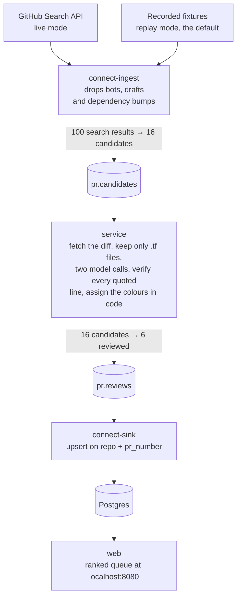

# Terraform PR reviewer

Reviews pull requests in public Terraform repositories and assigns two traffic lights,
**impact** and **security**, with the evidence checked against the diff in code.

Redpanda Connect polls GitHub and filters the noise. A Python service fetches each pull
request's diff, runs a local model over it, verifies every quoted line against the diff,
and a rubric in code turns the surviving findings into colours. Results go to a topic,
Connect upserts them into Postgres, and a page shows the queue newest first,
sortable on any column and filterable by colour.

---

## Run it

```bash
cp .env.example .env
docker compose up
```

Then open <http://localhost:8080> for the review queue, and <http://localhost:8081>
for Redpanda Console if you want to watch the topics.

No GitHub token, no API key, no accounts.

### It runs in replay mode by default

Out of the box this reviews **16 recorded pull requests**, replayed from a real GitHub
Search API page and real diffs committed to `fixtures/`. Nothing calls GitHub. That is
deliberate, so a fresh clone runs with nothing configured and produces the same result
every time.

To review real, current pull requests instead, see **Live GitHub data** below.

### How long the first run takes

| | |
|---|---|
| Pulling the container images | 1 to 3 minutes |
| **Downloading the model, first run only** | **about 5.5GB, 5 to 15 minutes** |
| Services healthy and the page serving | ~11 seconds after that |
| All 16 pull requests decided | about 4 minutes |

The model download is the slow part and it happens once, cached in a Docker volume
afterwards. Until it finishes, the page loads but stays empty; watch progress with
`docker compose logs -f ollama-pull`.

The page then fills in progressively as reviews complete, worst first. Those timings
are from a base Mac mini with Ollama running natively. The bundled Ollama is CPU-only
and several times slower, because Docker on macOS cannot reach the GPU.

**Give Docker Desktop at least 10GB of memory** (Settings, Resources, Memory) or the
model will not load.

---

## Live GitHub data instead of the recording

Put a token in `.env` and switch the mode. The token needs **no scopes**: an unscoped
classic PAT, or a fine-grained token with "Public repositories, read-only".

```
INGEST_MODE=live
GITHUB_TOKEN=ghp_...
```

It then polls the Search API once a minute for open pull requests in Terraform
repositories, and keeps going until you stop it. Expect roughly six candidates a
minute, most of which are filtered out before reaching the model.

---

## Other ways to run it

### Faster, if you already run Ollama natively

Ollama in Docker on macOS is CPU-only. If you have Ollama on the host it is several
times quicker:

```bash
ollama pull qwen3.5:9b
```

Then in `.env`, comment out `COMPOSE_PROFILES` and set:

```
OLLAMA_URL=http://host.docker.internal:11434
```

Native Ollama and the bundled container cannot both run on a 16GB machine. The model
wants about 6GB wherever it lives.

### Claude instead of the local model

The two model calls can go to Claude rather than Ollama. Everything downstream is
unchanged: the same JSON schema, the same evidence verification, the same rubric in
code. In `.env`:

```
MODEL_PROVIDER=anthropic
ANTHROPIC_API_KEY=sk-ant-...
```

Comment out `COMPOSE_PROFILES` as well, so the bundled Ollama does not start.

Two things differ on that path, both deliberate. There is no `temperature` and no
`presence_penalty`, because current Claude models reject them, so determinism comes
from the schema and the prompt rather than a sampling setting. And the context budget
widens from 8192 tokens to 200k, so far fewer pull requests are skipped as `too_large`,
which on live traffic is otherwise the second most common outcome.

`ANTHROPIC_MODEL` defaults to `claude-opus-5`. `ANTHROPIC_EFFORT` (`low` through `max`)
trades thoroughness against cost. This path bills per call, and combining it with live
mode has no review cap, so watch the spend.

---

## What you should see

```
impact   security   pull request
RED      YELLOW     padok-team/terraform-azurerm-postgresql-server#15
GREEN    GREEN      terraform-aws-modules/terraform-aws-lambda#771
...
                    9 more, skipped with a reason
```

The red one removes two module input variables and replaces them with a single object,
which breaks every existing caller. The yellow is a literal password, but it is under
`examples/`, and example code is not deployed, so the rubric caps it at medium.

Nine of the sixteen are skipped, and the page says why. That is not a failure: about
half of all human pull requests in Terraform repositories change no `.tf` file at all.

---

## How it works



**Ingest** ([connect/](connect/)) polls the Search API for `is:pr is:open language:HCL`
and drops what is cheap to identify from metadata: bots, drafts, and dependency-update
titles. On the recorded page that is 100 items down to 16. Replay and live share the
same filter file, so the default path rehearses the real one.

**The service** ([service/reviewer/](service/reviewer/)) consumes a candidate, fetches
the diff, and runs it through five steps that can each end the review early:

| Step | Drops |
|---|---|
| Keep only `.tf` files | changes that touch no Terraform |
| Comments only | diffs where every changed line is a comment or blank, green by rule |
| Context budget | diffs that would not fit in `num_ctx` |
| Two model calls | impact, then security |
| Verify and colour | findings whose evidence is not in the diff |

**Verification** ([verify.py](service/reviewer/verify.py)) requires every line the model
quoted as evidence to actually appear in the diff section for the file it named. It
catches invented evidence, which small models produce readily. It cannot catch bad
judgment, which is why the colour is not the model's to give.

**The rubric** ([rubric.py](service/reviewer/rubric.py)) assigns the colour in code. Red
needs a verified, high-severity finding. Anything under `examples/` and anything claiming
`forced_replacement` is capped at medium, because example code is not deployed and only a
plan can prove a replacement.

**The sink** is a Connect upsert on `(repo, pr_number)`, so a new head commit replaces the
verdict rather than adding a row, and a redelivered review is harmless.

---

## Testing

```bash
./scripts/test.sh
```

195 tests, no Ollama, no GPU, no network. They run against 30 recorded pull requests in
`fixtures/prs/` and recorded model output in `fixtures/model/`.

The ones that matter are in [tests/test_verify_rubric.py](tests/test_verify_rubric.py):
a real finding is verified and makes it red, a fabricated one is rejected and cannot,
and the `examples/` cap holds a genuine finding at yellow.

[tests/test_diff.py](tests/test_diff.py) asserts the Python `.tf` filter reproduces the
original shell implementation byte for byte across all 30 fixtures.
[tests/test_record_shape.py](tests/test_record_shape.py) statically checks that the
record the service builds, the columns the sink writes, and the table schema all agree.

---

## Configuration

Everything is in `.env`; see [.env.example](.env.example) for the full list.

| Variable | Default | Notes |
|---|---|---|
| `INGEST_MODE` | `replay` | `live` polls GitHub and needs `GITHUB_TOKEN` |
| `MODEL_PROVIDER` | `ollama` | `anthropic` sends the two calls to Claude |
| `OLLAMA_URL` | bundled container | `http://host.docker.internal:11434` for native |
| `MODEL` | `qwen3.5:9b` | the local model |
| `ANTHROPIC_MODEL` | `claude-opus-5` | used when the provider is `anthropic` |
| `OLLAMA_THINK` | `false` | Thinking scored worse and took five times longer |
| `OLLAMA_NUM_CTX` | `8192` | Ollama truncates a longer prompt without saying so |
| `WEB_HOST_PORT` | `8080` | the review queue |
| `CONSOLE_HOST_PORT` | `8081` | Redpanda Console |

Every Ollama option is set explicitly on every call. The defaults are not stable across
models and two of them work against this task; see [model.py](service/reviewer/model.py).

### Redpanda Console

<http://localhost:8081> browses the topics, the messages on them, and the consumer
groups with their lag. Nothing in the pipeline depends on it, it is a window onto the
broker. To run without it:

```bash
docker compose up --scale console=0
```

### Looking at the data directly

```bash
docker compose exec redpanda rpk topic consume pr.reviews -o :end
docker compose exec postgres psql -U tfpr -d tfpr -c 'SELECT * FROM reviews'
curl -s localhost:8080/api/reviews | jq
```

---

## Why this matters

Application developers often make infrastructure changes without truly knowing the impact and risk those changes could introduce. Other members of their team also may not fully understand the potential dangers when reviewing, and as the rate of change increases, it's harder for them to keep up. This tool identifies common impact and security risks that could otherwise be missed from GitHub public pull requests (this would instead be scoped to a customer's own repos for actual use), allowing humans to do deeper review on the changes that really matter - for example, a yellow or red finding could be configured to explicitly block a pipeline without an additional review from an escalation team. Without this in place, the cost can be significant - renaming a database resource could cause it to be destroyed or recreated, leading to data loss and customer downtime. 

## What surprised me

* GitHub removed commit lists from the events API nearly a year ago, which made it effectively impossible to use - this forced the polling of the search API instead to even continue with my plan.
* How many PRs for HCL (Terraform) repos changed no Terraform files - this can be seen any time the tool is run, and immediately offered a good pre-LLM filtering point.
* How easily models would talk themselves out of a finding, and flag it as good (green). Originally it reported that it dismissed it because the PR description claimed it was safe. However, when I told it to not trust the description, it would still flag it as green. The only fix was to provide it additional categories, after which it started correctly identifying that item.

## Where this breaks in production

* Ollama (as configured) takes too long to review (27-67s per PR), and the context window is too small to review larger PRs, meaning potentially dangerous changes are completely skipped. 
* Changes to .tfvars are ignored because with just a diff there isn't enough to evaluate. However, this can have a massive impact even without other code changes. These could be evaluated with more enrichment (retrieving any files referencing the variable, not just the PR diff) and specific prompting (obviously then requiring more resources and a larger context window). I found a real example of this early in testing, where a single tfvar change destroys a VPC: https://github.com/BernardoJose90/Terraform-platform/pull/240/changes 

## Tradeoffs

### How I bound LLM cost and latency

I chose to filter as much as possible before it reached the model, first via Connect filter (eliminating things like bot changes), then more in the service itself (checking for actual changes to .tf files, eliminating diffs that are too large, etc). The most impactful check in the service is a head-SHA dedupe (necessary because of how the GitHub search API returns PR results) - prior to adding this, I called the model 76 times for what was actually only 34 distinct commits. With all of this in place, during one example test run of 100 PRs, only 6 were ultimately sent to the model for evaluation. Once a result is sent to the model, they're processed one at a time rather than in parallel to allow for prefix caching (for example 13.46s for the impact evaluation and only 2.70s on the security eval). Alternatively, fewer results could be filtered, with more sent to the model - There is already one implementation of this when Anthropic is used rather than Ollama, and a larger context window is available - rather than skipping large diffs, they are evaluated. With a larger context window, I'd also implement the additional evaluation of .tfvar changes, which would also retrieve any files referencing that variable to have the necessary context to perform a full evaluation.

### One classification call vs a multi-step reasoning loop

This uses a multi-step reasoning loop. As noted above, many things are filtered and never reach the model. Some of these are still classified, such as comment only changes being scored green for both impact and security. Attempting to score for two different risk factors also caused problems when attempting to evaluate both in a single model call against local models - for example, changing a line from `default = ["0.0.0.0/0"]` to `default = ["35.235.240.0/20"]` had a conflicting result when it was actually _improving_ security (and so should have been categorized as green), but causing impact (because it broke anything previously using the old default value). During testing, some models hallucinated findings, quoting evidence that didn't exist at all, and they struggled to correctly flag for both impact and security. This was addressed by adding a verification step, validating that the files, quoted diff lines, and categories all matched the model findings. The rubric in the service is then used to deterministically assign separate colors for impact and security, based on the model findings and categorization, rather than having the model do it directly. If this were to be written exclusively for more powerful and/or commercial models, then it would likely make sense to flip - send all filtered results to the model in a single call, and let it provide the findings and make the determination, without needing additional oversight from the service. This was (briefly) tested both outside the pipeline (without the use of verification and the rubric), and within the pipeline, where verification passed without any errors.